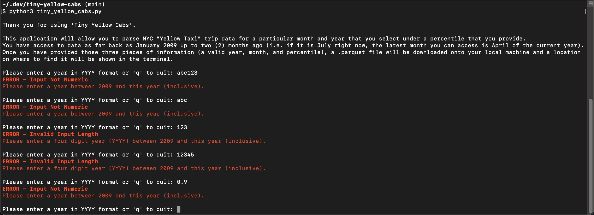
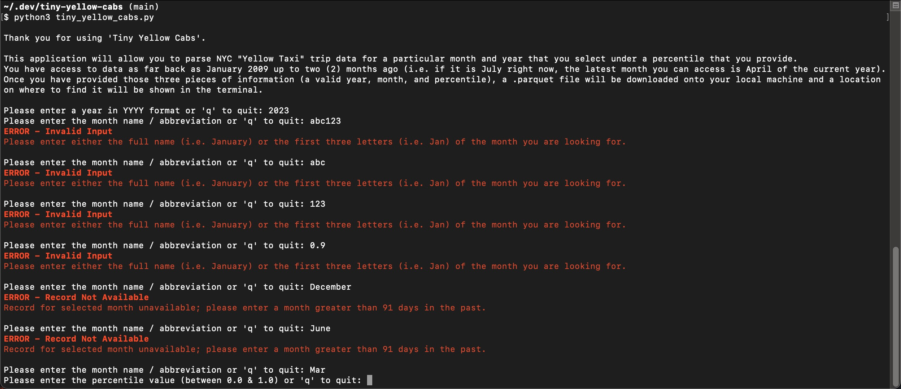
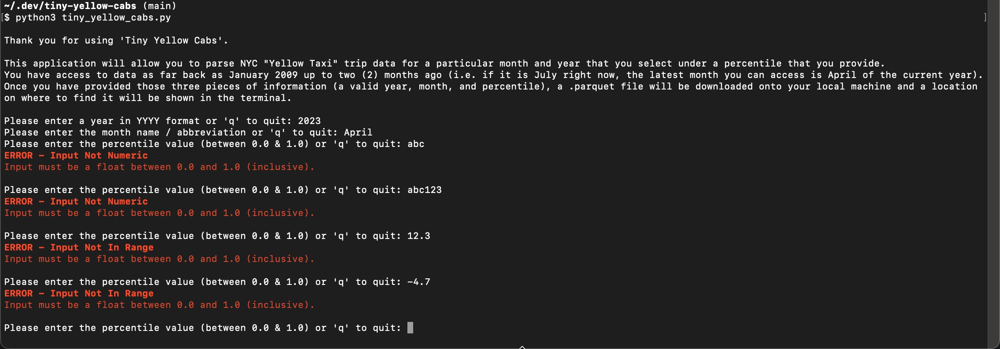
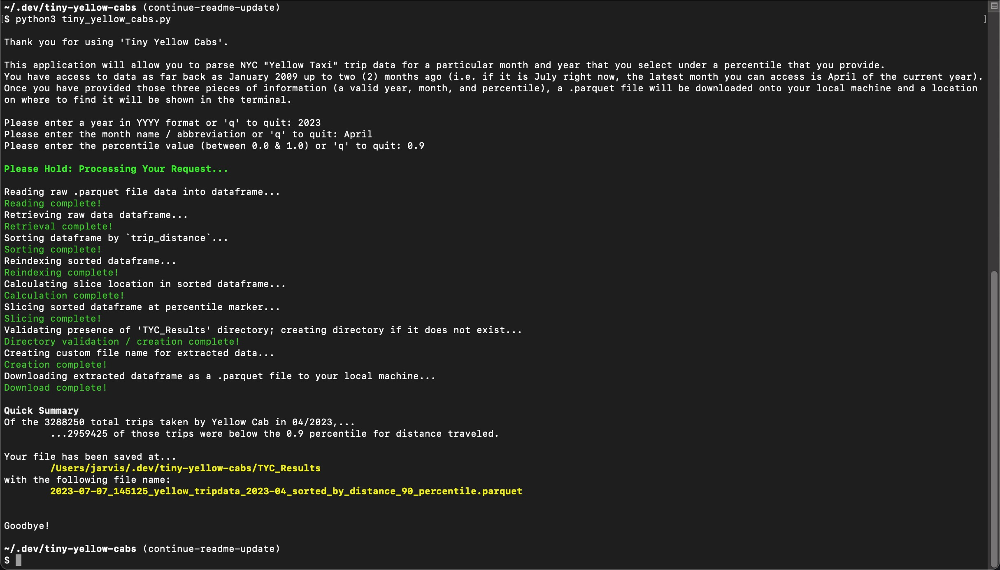

# Tiny Yellow Cabs

"Tiny Yellow Cabs" is a program that I wrote as part of the [interview process](https://gist.github.com/javisantana/a1962319a06dd1a05b14d5e9738c8f75) for a Data Engineer position at [Tinybird](https://www.tinybird.co/). At its core, the program pulls a slice of data from the [NYC “Yellow Taxi” Trips Data](https://www1.nyc.gov/site/tlc/about/tlc-trip-record-data.page) site, returning the resulting data as a .parquet file to the User's local machine. When executed, the program will prompt the User with three questions:

1. What year are you looking to get the data from?
2. What month (of that year) are you looking to get the data from?
3. Under what percentile of `trip_distance` traveled are you looking to have returned to you?

Once answered, the program will load a .parquet file containing that extracted data to the User's local machine for review at their leisure.

## Table of Contents

- [Using The Program](https://github.com/rscottlundgren/tiny-yellow-cabs#using-the-program)
  - [Download Python 3.11](https://github.com/rscottlundgren/tiny-yellow-cabs#download-python-311)
  - [Cloning The Repo](https://github.com/rscottlundgren/tiny-yellow-cabs#cloning-the-repo)
  - [Running The Program](https://github.com/rscottlundgren/tiny-yellow-cabs#running-the-program)
- [Approach](https://github.com/rscottlundgren/tiny-yellow-cabs#approach)
  - [Prep Work](https://github.com/rscottlundgren/tiny-yellow-cabs#prep-work)
  - [Execution](https://github.com/rscottlundgren/tiny-yellow-cabs#execution)
- [Dataset Considerations](https://github.com/rscottlundgren/tiny-yellow-cabs#dataset-considerations)
- [Helpful Resources / Links](https://github.com/rscottlundgren/tiny-yellow-cabs#links)

## Using The Program
### Download Python 3.11
This program was built using Python 3.11. If you do not have Python 3.11 installed, instructions on downloading Python 3.11 can be found on the [Python language website](https://www.python.org/downloads/). To confirm you've installed it, run the following command and you should receive the following result:
```
$ python3 --version
Python 3.11.4
```

### Cloning The Repo
Once you have a working version of Python 3.11 on your local machine...
1. Clone this repo and `cd` (`c`hange `d`irectory) into that folder by running the following commands: 
    ```
    git clone https://github.com/rscottlundgren/tiny-yellow-cabs.git
    cd tiny-yellow-cabs
    ```

### Running The Program
1. Before starting the program, you'll want to install the appropriate dependencies by running this script:
   ```
   pip3 install -r requirements.txt
   ```
2. To start the program, enter the following command into your terminal and hit "Enter":
   ```
   python3 tiny_yellow_cabs.py
   ```
3. The program will then prompt you with its first question - asking you to enter a year (that year should be between 2009 and the current year). Enter your selected year and hit "Enter".
4. The program will then prompt you with its second question - asking you to enter a month (that month should be entered as either a full name (i.e. January) or a three-letter abbreviation (i.e. Jan) and should be a month that occurred 2 months prior to the present month or earlier). Enter your selected month and hit "Enter". If you're looking for further examples the below might help:

   1. If today is March 15, 2023 and you entered 2023 as your year, the latest month you can enter is January / Jan
   2. If today is February 28, 2024 and you entered 2023 as your year, the latest month you can enter is November / Nov
   3. If today is July 4, 2023 and you entered 2020 as your year, the latest month you can enter is December / Dec

5. The program will then prompt you with its third (and final) question - asking you to enter a percentile (that percentile should be a decimal (aka a float) between 0.0 and 1.0, inclusive). Enter your desired percentile and hit "Enter".
6. After the questions have been answered, the program will run through a series of actions, documenting each action to the Terminal. At the end of the program you'll receive a quick summary of the data that was parsed and details as to where the results file (`.parquet` extension) is stored, then the program will shut down.

[Back To Top](https://github.com/rscottlundgren/tiny-yellow-cabs)

## Approach

### Prep Work

After reading the [assigned Gist](https://gist.github.com/javisantana/a1962319a06dd1a05b14d5e9738c8f75) I decided that I wanted this program to be a little more "interactive". I dug into the [NYC “Yellow Taxi” Trips Data](https://www1.nyc.gov/site/tlc/about/tlc-trip-record-data.page) site reading what I could about how and when the data was gathered as well as how and where it was stored. As the Gist left what month would be filtered open ended...

> Using NYC “Yellow Taxi” Trips Data, give me all the trips over 0.9 percentile in distance traveled for _any_ of the parquet files you can find there.

...I decided that I wanted to make any of the data available on the site available to the User by entering the year and month of their choice. Thankfully, this was easy because, after reviewing [all of the links](./docs/refs/`tiny-yellow-cab-data`%20-%20Parquet%20File%20Names%20By%20Month.pdf) contained on the site for "Yellow Taxi Trip Records", it was clear that getting the numeric year and month values that the User was looking for would be enough to automate the process, so those would have to be validated and stored somewhere.

Having worked with data-focused clients in the past, I know that they tend to start with an initial filtered view of the data they are working on then explore from there. I wanted to enable the User to be able to choose any percentile as a filter - especially if the program would later be expanded to include filtration options that went beyond just `trip_distance`.

Now I had my three User questions...
1. What year's data are you looking for?
2. What month (in that year's data) are you looking for?
3. What percentile of the `trip_distance` data are you looking to retrieve?

...and I had my ideal "MVP" functionality:
- [ ] The ability for the User to determine the specific month & year's data set they are looking to extract
- [ ] The ability for the User to determine the specific percentile's "worth" of data that they are looking to extract
- [ ] The ability for the program to validate the User provided data (so they don't request something that doesn't actually exist / doesn't exist yet)
  - [ ] Additionally, it would be good if the program "did the math" for those files that don't exist yet, allowing the program to not require "hardcoded" months / years as validators 
- [ ] The program would save the extracted data, in a .parquet extension, to the User's local machine (in a specifically created folder within the cloned repo's file path would be easiest)
- [ ] The program would have some amount of "logging" in the terminal to notify the User what step the program is on in the extraction and download process
- [ ] The program would return some kind of data snapshot and a location of the file so the User knew where to go to retrieve it

I reached out to "the Client" (aka Tinybird) with [further exploratory questions](./docs/questions.md) and with my questions answered I began moving forward with my program.

### Execution

Due to the relative size of the program I wanted to keep things as compact as possible relying on a main file ([tiny_yellow_cabs.py](tiny_yellow_cabs.py)) to handle user interaction, a validation module ([validators.py](validators.py)) to handle user data validation, and a class 'YellowCabDistanceStats' ([yellow_cab_distance_stats.py](yellow_cab_distance_stats.py)) to handle creation and extraction of all data. The overall program follows a simple flow of control. 

#### First Request: "Please enter the month name / abbreviation or 'q' to quit: "

The first action the program will take is to establish some state variables holding sentinel values (which will be discussed later) and it will ping the local machine for the current working directory of the cloned repo (this will be used later).

After some brief introductory text is displayed in the terminal, the User is prompted with their first request or the option to quit the program by typing 'q'. If they choose to quit the program at this time, each subsequent point of control flow will be shortcircuited by the default sentinel values in the program, leaving the program to say "Goodbye!" to the User before quitting.

If the User enters a value that is not within the accept range of 2009 to the present year (determined by the value returned using `datetime.date.today().year`), then an appropriate error message is displayed based on the value entered and the User is again prompted to enter a valid year:



Once the user has entered a valid year (between 2009 and the present year), the program will save that year to a variable and will move onto the second request.

For the sake of this example, let's say the User has entered the present year - 2023.[^1]

#### Second Request: "Please enter the month name / abbreviation or 'q' to quit: "
Just like with the first request, the User is prompted to provide a valid answer or the option to quit the program by typing 'q'. If they choose to quit the program at this time, each subsequent point of control flow will be shortcircuited by the default sentinel values in the program, leaving the program to say "Goodbye!" to the User before quitting.

If the User has selected a year that has fully elapsed (e.g. a year between 2009 - 2022, inclusive), then a valid month value is the string representation of any of the twelve months that have occurred during that year (January - December, Jan - Dec). However, in our example (where our year was 2023), we also have to accommodate the two (2) month delay the TLC enforces. This means that the program has to determine whether or not the month is outside of that two (2) month window. It does this by creating a date object out of the User provided month and year (e.g. we previously select 2023 as our year and we now choose March / Mar as our month) and subtracting that date object from the `datetime.date.today()` value and returning the number of days that have elapsed between those two date objects. If that value is greater than 91, then the selected month is a valid month and the program will save that month to a variable and will move onto the third request.

Finally, just like in the first request, if the User does not enter a valid month based on their selected year, they will receive an appropriate error message in the terminal based on their provided value and will again be prompted to enter a valid month:



For the sake of this example, let's say the User has entered April / Apr as their month.

**Hold on, wait... why 91 days? Why not 60 days?**
Good question! It's July 7, 2023 today and looking at the [NYC “Yellow Taxi” Trips Data](https://www1.nyc.gov/site/tlc/about/tlc-trip-record-data.page) site the most recent available month is April 2023, which means there's a two month difference (May & June) between today (July) and the most recent available month. If the program were to calculate a 61 days difference (the extra day is just a nice buffer to give to the TLC), then if I entered, May 2023 as my month and year into the program, we would get a result of 67 days. That's more than 61 but May isn't available on the NYC "Yellow Taxi" Trips Data site today (sadly). This means the program needs to build in an extra 30 days (30 + 61 = 91) to accommodate for that two month period between the current date and the most recent available data.

#### Third Request: "Please enter the percentile value (between 0.0 & 1.0) or 'q' to quit: "
Just like with the first and second requests, the User is prompted to provide a valid answer or the option to quit the program by typing 'q'. If they choose to quit the program at this time, each subsequent point of control flow will be shortcircuited by the default sentinel values in the program, leaving the program to say "Goodbye!" to the User before quitting.

If the User has entered a value that is not within the accepted range of 0.0 to 1.0 (inclusive), then an appropriate error message is displayed based on the value entered and the User is again prompted to enter a valid year:



Once the User has entered a valid percentile (between 0.0 and 1.0 (inclusive)), the program will save that percentile to a variable and will move onto processing the request for data.

For the sake of this example, let's say the User has entered 0.9 as the percentile.

#### Processing The Request & Returning The Results

After securing valid year, month, and percentile data points, and calling the value stored in the state variable holding the current working directory, the program will create an instance of the "YellowCabDistanceStats" class which will take the following steps:

1. It will assign the year to the class' year attribute
2. It will assign the month to the class' month attribute
3. It will assign the percentile to the class' percentile attribute
4. It will make a connection to the URL where the desired parquet file is stored and it will read that parquet file into a pandas dataframe which will be stored in the class' raw dataframe attribute[^2]
5. It will take the stored raw dataframe, sort and reindex the dataframe by `trip_distance`, calculate the slice index by multiplying the stored percentile by the total number of rows in the raw dataframe, and slice the raw dataframe, storing the lower portion of the slice in the class' below percentile dataframe attribute
6. It will store the total number of raw trips in the class' total raw trips attribute
7. It will store the total number of trips that are below the percentile in the class' total below percentile trips attribute
8. It will store the saved file path (which is used to create the folder which will hold the results) to the class' saved file path attribute
9. It will store the saved file name of the downloaded document to the class' saved full file name attribute

As the program is completing these tasks of storing data for later recall it is posting messages to the terminal window, notifying the User of which action is presently being taken at that point and notifying them once the process is complete.

Finally, when the class has been created, the parquet file containing the month and year data that's under the provided percentile is saved to the User's machine and a brief summary of the data contained therein (along with the file path and location of the returned file) are printed to the terminal before the program closes.



[Back To Top](https://github.com/rscottlundgren/tiny-yellow-cabs)

## Dataset Considerations

The TLC collects trip record information for each taxi and for-hire vehicle trip completed by their licensed drivers and vehicles. They receive taxi trip data from the technology service providers (TSPs) that provide electronic metering in each cab, and FHV trip data from the app, community livery, black car, or luxury limousine company, or base, who dispatched the trip. In each trip record dataset, one row represents a single trip made by a TLC-licensed vehicle.

While the TLC yellow taxi trip records include fields capturing pick-up and drop-off dates/times, pick-up and drop-off locations, trip distances, itemized fares, rate types, payment types, and driver-reported passenger counts (among others), the website makes it very clear:

> **Warning**
> 
> The data used in the attached datasets were collected and provided to the NYC Taxi and Limousine Commission (TLC) by technology providers authorized under the Taxicab & Livery Passenger Enhancement Programs (TPEP/LPEP).

As such, anyone working with this data should know that it may not be completely clean, due to the human element involved in the data captured.

Trips made by the New York City's iconic yellow taxis have been recorded and provided to the TLC since 2009. Specific to the "Yellow Taxi" trip data, there is an additional column of data - `airport_fee` - which has been added to all .parquet files starting from January 2011 to later.

Another change to a subset of the data: TPEP and LPEP trip data PARQUETs from January through June 2015 have been updated to include a new field - `improvement_surcharge` - which lists the itemized portion of the fare covering the Taxicab Improvement Surcharge or Street Hail Livery Improvement Surcharge; This is a $0.30 surcharge on all trips to help fund accessibility in taxis and SHLs, which began on January 1, 2015; All TPEP and LPEP trip data files uploaded moving forward will also include this new field.

[Back To Top](https://github.com/rscottlundgren/tiny-yellow-cabs)

## Links

| Description | Static | Live |
| --- | ------ | ---- |
| **TLC Trip Record Data - Site Screen Capture** | [Static](./docs/refs/www.nyc.gov_site_tlc_about_tlc-trip-record-data.page.png) | [Live](https://www.nyc.gov/site/tlc/about/tlc-trip-record-data.page) |
| **TLC Trip Record Data - User Guide** | [Static](./docs/refs/trip_record_user_guide.pdf) | [Live](https://www.nyc.gov/assets/tlc/downloads/pdf/trip_record_user_guide.pdf) |
| **TLC Trip Record Data - Yellow Trips Data Dictionary** | [Static](./docs/yellowTaxiDataDictionary.md) | [Live](https://www.nyc.gov/assets/tlc/downloads/pdf/data_dictionary_trip_records_yellow.pdf) |

[Back To Top](https://github.com/rscottlundgren/tiny-yellow-cabs)

## Fun Facts Learned During This Project

**Did You Know...**
- Created in 1971, the New York City Taxi and Limousine Commission (TLC) is the agency responsible for licensing and regulating New York City's medallion (yellow) taxis, street hail livery (green) taxis, for-hire vehicles (FHVs), commuter vans, and paratransit vehicles
- Yellow taxis are traditionally hailed by signaling to a driver who is on duty and seeking a passenger (street hail), but now they may also be hailed using an e-hail app like Curb or Arro
- Yellow Taxis are the only vehicles permitted to respond to a street hail from a passenger in all five boroughs
- Each of the trip records contained in these datasets contains a field corresponding to the location of the pickup or dropoff of the trip (or in FHV records before 2017, just the pickup), populated by numbers 1 - 263 and that these Taxi Zones are roughly based on NYC Department of City Planning's Neighborhood Tabulation Areas (NTAs) and are meant to approximate neighborhoods, so you can see which neighborhood a passenger was picked up in, and which neighborhood they were dropped off in
- NYC has a citywide open data platform (called "NYC Open Data") where all agencies share data for free, with everyone, to increase transparency and foster civic innovation. The TLC specifically publishes about 60 different data sets on that portal alone. Further that portal allows users to customize the data they'd like to download before they download it and to download it in the format that works best for them. Finally, each dataset on open data has linked metadata available including when the dataset was last updated, what it contains, and (often) a link to a data dictionary. If you're interested in checking out the portal (and their API), the links have been provided below:
  - The portal: https://opendata.cityofnewyork.us/
  - The API: https://dev.socrata.com/foundry/data.cityofnewyork.us/pqfs-mqru

[^1]: At the time of this writing, the date was 07/07/2023 or July 7, 2023.
[^2]: Thankfully the parquet files are stored following a standardized file path where the only differentiating markers are the year and the month, which is what allows this call to be so brief.